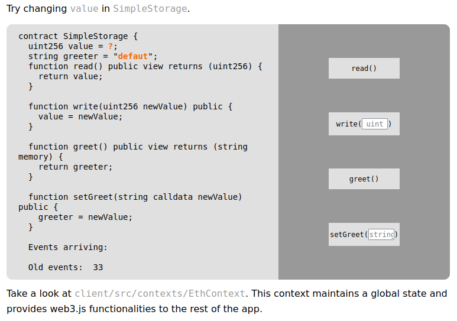

# Truffle Project Deployment to Vercel and Goerli Network

<!-- TOC -->

- [Truffle Project Deployment to Vercel and Goerli Network](#truffle-project-deployment-to-vercel-and-goerli-network)
	- [Overview:](#overview)
	- [Truffle Configuration:](#truffle-configuration)
	- [Deployment Instructions:](#deployment-instructions)
	- [Front-End Application:](#front-end-application)
		- [Building log](#building-log)
		- [See it in action](#see-it-in-action)
	- [React Truffle Box](#react-truffle-box)
		- [Installation](#installation)
	- [FAQ](#faq)

<!-- /TOC -->

## Overview:

Welcome to the **Truffle** Project Deployment to **Vercel** and **Goerli** Network repository. In this project, we explore the seamless deployment of **Ethereum smart contracts** developed using Truffle to the Goerli test network and host a front-end application on Vercel for easy interaction.

## Truffle Configuration:

To get started, ensure you have Truffle installed globally. We have pre-configured Truffle for you, making it easy to deploy your smart contracts. Open the `truffle-config.js` file to see the network configurations, including the **Goerli network** settings.

```javascript
require('dotenv').config();
const { MNEMONIC, PROJECT_ID } = process.env;
const HDWalletProvider = require('@truffle/hdwallet-provider');

  module.exports = {
  contracts_build_directory: "../client/src/contracts",
  networks: {

    development: {
     host: "127.0.0.1",     // Localhost (default: none)
     port: 8545,            // Standard Ethereum port (default: none)
     network_id: "*",       // Any network (default: none)
    },

    goerli: {
      provider: function() { 
        return new HDWalletProvider(
            `${process.env.MNEMONIC}`, 
            `https://goerli.infura.io/v3/${process.env.INFURA_ID}`
        )
      },
      network_id: 5, // --> https://chainlist.org/?search=goerli&testnets=true
    },

  },

  // Set default mocha options here, use special reporters, etc.
  mocha: {
    // timeout: 100000
  },

  // Configure your compilers
  compilers: {
    solc: {
      version: "0.8.18",      // Fetch exact version from solc-bin (default: truffle's version)
    }
  },

};
```

Ensure you have your **Infura API key** and **mnemonic** set up for secure deployments in your `.env` file.

Also, don't forget to initialize correctly your `.gitignore` file to prevent uneccesary files transfert and sensible information.

```bash
# See https://help.github.com/articles/ignoring-files/ for more about ignoring files.

# pendencies
node_modules
.pnp
.pnp.js

# Production
build
#--client/src/contracts
client/*/src/contracts

# Testing
coverage

# Env
.env
.env.local
.env.development.local
.env.test.local
.env.production.local

# Editor
.vscode

# Misc.
.DS_Store

npm-debug.log*
yarn-debug.log*
yarn-error.log*

# add
client/node_modules
```


## Deployment Instructions:

1. Compile your smart contracts using Truffle:
   ```shell
   truffle compile
   ```

2. Migrate your contracts to the Goerli network:
   ```shell
   truffle migrate --network goerli
   ```

3. Once your contracts are deployed, you'll receive contract address. In our case also inside the file `SimpleStorage.json`(with **ABI** definition too) in `client/src/contracts/` folder.
  ```json
    "networks": {
      "5": {
        "events": {},
        "links": {},
        "address": "0x6C64fd92822Cc4505351052BA1Eb1FC2adD26dBb",
        "transactionHash": "0x64352f622c81884899b5d54600bc6b055362072b9c6b6810ffcbd596a72f73b2"
      },

      ...
  ```

4. You can check the deployment on **Etherscan** for **Goerli Tesnet**, here : [Contract Address](https://goerli.etherscan.io/address/0x6C64fd92822Cc4505351052BA1Eb1FC2adD26dBb) and see the 
[Decompiled Bytecode](https://goerli.etherscan.io/bytecode-decompiler?a=0x6C64fd92822Cc4505351052BA1Eb1FC2adD26dBb)

## Front-End Application:

Decentralized App is deployed on **Vercel** at [**React Truffle Box**](https://alyra-dapp-deploy.vercel.app/)

It's a basic React front-end application to interact with your smart contracts. The application is hosted on Vercel for easy access. To deploy your front end, make sure to configure your Vercel settings.

### Building log

```shell
[15:38:41.597] Running build in Washington, D.C., USA (East) – iad1
[15:38:41.719] Cloning github.com/Laugharne/alyra_dapp_deploy (Branch: main, Commit: 5eda9af)
[15:38:41.968] Cloning completed: 248.667ms
[15:38:43.726] Restored build cache
[15:38:43.793] Running "vercel build"
[15:38:44.290] Vercel CLI 32.2.0
[15:38:44.942] Installing dependencies...
[15:38:46.823] 
[15:38:46.823] up to date in 2s
[15:38:46.823] 
[15:38:46.823] 176 packages are looking for funding
[15:38:46.824]   run `npm fund` for details
[15:38:46.840] Detected `package-lock.json` generated by npm 7+...
[15:38:46.841] Running "npm run build"
[15:38:47.141] 
[15:38:47.141] > truffle-client@0.1.0 build
[15:38:47.141] > webpack
[15:38:47.142] 
[15:38:51.528] 3 assets
[15:38:51.528] 48 modules
[15:38:51.528] webpack 5.75.0 compiled successfully in 3689 ms
[15:38:51.573] Build Completed in /vercel/output [7s]
[15:38:51.676] Deploying outputs...
[15:38:52.747] Deployment completed
[15:38:59.505] Uploading build cache [23.22 MB]...
[15:39:00.895] Build cache uploaded: 1.390s
```
### See it in action




## React Truffle Box

This box comes with everything you need to start using Truffle to write, compile, test, and deploy smart contracts, and interact with them from a React app.

### Installation

First ensure you are in an empty directory.

Run the `unbox` command using 1 of 2 ways.

```sh
# Install Truffle globally and run `truffle unbox`
$ npm install -g truffle
$ truffle unbox react
```

```sh
# Alternatively, run `truffle unbox` via npx
$ npx truffle unbox react
```

Start the react dev server.

```sh
$ cd client
$ npm start
```

From there, follow the instructions on the hosted React app. It will walk you through using Truffle and Ganache to deploy the `SimpleStorage` contract, making calls to it, and sending transactions to change the contract's state.

## FAQ

- __How do I use this with Ganache (or any other network)?__

  The Truffle project is set to deploy to Ganache by default. If you'd like to change this, it's as easy as modifying the Truffle config file! Check out [our documentation on adding network configurations](https://trufflesuite.com/docs/truffle/reference/configuration/#networks). From there, you can run `truffle migrate` pointed to another network, restart the React dev server, and see the change take place.

- __Where can I find more resources?__

  This Box is a sweet combo of [Truffle](https://trufflesuite.com) and [Webpack](https://webpack.js.org). Either one would be a great place to start!
